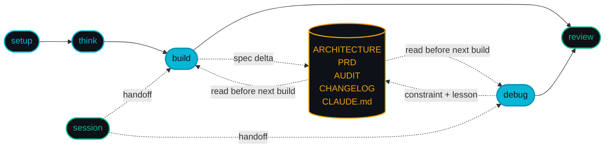

<div align="center">


### Your CTO in a plugin.

**Universal across web / CRM / C++ / C# / Rust / game cheats / embedded / mods. Opus 4.7 plans, Sonnet 4.6 executes. Stack-aware, pace-aware, production-grade.**

<br />

[](https://github.com/DIV7NE/straight-to-production/releases)
[](LICENSE)
[](https://claude.ai)
[]()

[]()
[]()
[]()
[]()
[]()
[]()

</div>

---

## Install

Open Claude Code and run:

```
/plugin marketplace add DIV7NE/straight-to-production
/plugin install stp@stp
```

Then run the guided setup:
```
/stp:setup welcome        # pick profile + pace, detect stack, show you around
```

Or jump straight in:
```
/stp:setup new            # start a new project from scratch
/stp:setup onboard        # onboard an existing codebase (read-only)
```

### What `/stp:setup welcome` does

First-run onboarding in about two minutes:

1. **Detect stack** — sniffs the repo, writes `.stp/state/stack.json` (web / node / python / go / rust / csharp / java / cpp / game / cheat-pentest / embedded / mod / data-ml / generic)
2. **Pick model profile** — 6 options (balanced, opus-cto, sonnet-turbo, opus-budget, sonnet-cheap, pro-plan)
3. **Pick pace** — 4 options (deep, batched, fast, autonomous) — this is the curiosity dial
4. **Regenerate agents** — `hooks/scripts/regenerate-agents.sh` substitutes profile models into `agents/*.md`
5. **Chain into next step** — `new` (fresh repo), `onboard` (existing code), or exit

### Update

```
/stp:setup upgrade
```

Pulls the latest version, regenerates agents, refreshes hook manifests, and runs `migrate-v1.sh` for anyone coming from pre-v1.

### Uninstall

```
/plugin uninstall stp@stp
```

Removes the plugin. Project files (`.stp/`, `CLAUDE.md`) stay put.

---

## The Problem

Most Claude Code harnesses were built by senior web engineers for senior web engineers. They assume Next.js, assume React, assume a cloud deploy, assume you already know the security gotchas. If you're building a game cheat, a C++ engine, a Rust service, an Arduino firmware, or a CRM — half the tool is dead weight and the other half is wrong.

If you're a solo developer who doesn't already know the right stack for your domain, you're stuck debugging the harness instead of shipping the thing.

## How STP Works

You say what you want. STP detects the stack, picks the right pace for the task, runs the right hooks for that stack, plans the architecture with Opus 4.7, builds the thing with Sonnet 4.6, runs an independent Critic over the result, and teaches you what it did along the way. You handle product calls. Claude handles the rest.



The dotted lines are the four feedback loops. Every build writes back into the docs; every future build reads them before touching code. A bug you fix today leaves behind a rule that prevents the same class from coming back six months later.

```
YOU: "I need a CS2 external cheat with ESP + aim assist, undetected by VAC"

STP:
├── Detects stack → cheat-pentest (C++ / pattern-scan / overlay)
├── Picks pace → batched (default — 4 questions per call, not one-at-a-time)
├── Picks model profile → balanced (Opus plans, Sonnet executes)
├── Asks DESIGN questions only (detection model, overlay mode, legit vs rage)
├── Researches memory layouts + current VAC heuristics via Context7 + Tavily
├── Generates plan with Opus 4.7 @ xhigh effort → .stp/docs/PLAN.md
├── Independent Critic reviews plan (INVERSION: "report every issue found")
├── Spawns Sonnet 4.6 executor agents in worktree isolation
├── TDD: acceptance criteria → executable specs → behavioral tests → implementation
├── 19 enforcement hooks — stack-aware (UI gate skipped for cheat stack,
│   C++ type check replaces tsc, etc.)
├── 6-layer verification stack (deterministic + AI + mutation + property)
└── Auto-writes a Spec Delta into CHANGELOG → propagates to ARCHITECTURE + PRD
    → becomes a System Constraint the next feature has to obey
```

## What's in v1.0

- **6 skills, not 18 commands.** Every STP entry point is now a skill with subcommands and flags. `/stp:setup welcome|new|onboard|model|pace|upgrade`, `/stp:think [--plan|--research|--whiteboard]`, `/stp:build [--full|--quick|--auto]`, `/stp:debug`, `/stp:review`, `/stp:session pause|continue|progress`.
- **6 model profiles.** New: `sonnet-turbo` (Sonnet 4.6 @ xhigh, ~25% the cost of opus-cto for most work) and `pro-plan` (20-message budget, no sub-agents, deterministic-verification-only — built for Pro subscribers). Existing: `balanced` (default), `opus-cto`, `opus-budget`, `sonnet-cheap`.
- **14 supported stacks.** Web, Node, Python, Go, Rust, C#, Java, C++, Game, Cheat/Pentest, Embedded, Mod, Data/ML, Generic. Hooks know the stack — UI gate is skipped on non-UI stacks, type checks use the stack's compiler, test runners follow the stack's conventions.
- **4 pace modes.** `deep` = one question per decision, section-by-section validation (the old curiosity feel). `batched` (default) = up to 4 questions per AskUserQuestion call. `fast` = single plan, single approval. `autonomous` = zero questions after initial spec.
- **Opus 4.7 idioms, everywhere.** Every sub-agent spawn prompt now carries the `<use_parallel_tool_calls>` XML block, the context-limit line ("don't stop early due to token budget"), and — for the Critic — the INVERSION framing ("report every issue you find; downstream ranks severity, your job is recall not precision").
- **Statusline nudges.** The Node.js statusline now watches context usage and appends live nudges: 40–70% → `→ /compact if tool-heavy`, 70–90% → `→ /stp:session pause`, 90%+ → blinking `⚠ /stp:session pause NOW`.

## Skills

| Skill | Subcommands / flags | Purpose |
|-------|---------------------|---------|
| `/stp:setup` | `welcome` (default), `new`, `onboard`, `model`, `pace`, `upgrade` | Lifecycle — first-run, new project, onboard existing, switch profile, switch pace, upgrade plugin |
| `/stp:think` | default (brainstorming), `--plan`, `--research`, `--whiteboard` | Think before you build. No code written. Output is a design brief. |
| `/stp:build` | default (auto-route), `--full`, `--quick`, `--auto` | Build, fix, refactor. TDD mandatory. Hooks fire regardless of pace. |
| `/stp:debug` | (no subcommands) | Root cause + fix + defense-in-depth. Scientific method. Auto-gathers Sentry / git / architecture before asking anything. |
| `/stp:review` | optional focus area | Separate Critic grades against PRD + 7 criteria + 6-layer verification stack |
| `/stp:session` | `pause`, `continue`, `progress` | Session lifecycle — save state, resume, status dashboard |

**Auto-routing.** `/stp:build` without a flag runs an impact scan first (file count, model/migration detection, auth-touch detection). Small → `--quick`. Big → `--full`. Auth / payments / security always forces `--full`.

## Model Profiles

Six profiles. Pick one at `/stp:setup welcome`, switch anytime with `/stp:setup model`.

| Profile | Main | Sub-agents | When to use | Relative cost |
|---------|------|------------|-------------|---------------|
| **balanced** (default) | Opus 4.7 @ xhigh | Sonnet 4.6 (executor, QA, critic, researcher, explorer) | Most projects. Opus plans, Sonnet builds. | 1.0× |
| **opus-cto** | Opus 4.7 @ max, 1M context | Inline (main handles research + exploration) | Research-heavy, single-session architecture sprints | ~1.6× |
| **sonnet-turbo** | Sonnet 4.6 @ xhigh | Sonnet 4.6 | Fast iteration, cost-sensitive, no-Opus Pro accounts | ~0.25× |
| **opus-budget** | Opus 4.7 @ xhigh | Sonnet 4.6 (executor, researcher, explorer) + Haiku→Sonnet escalation (critic, QA) | Cost-optimized but Opus-planned | ~0.6× |
| **sonnet-cheap** | Sonnet 4.6 @ high (200K) | Sonnet 4.6 + Haiku→Sonnet escalation (critic, QA) | Solo dev on Pro plan, tight budget | ~0.2× |
| **pro-plan** | Sonnet 4.6 @ high | Inline only — NO sub-agents. Deterministic verification only. | Pro subscribers with 20-message/5h limits. Limits /stp:build --quick + debug + session to 30 msgs/feature, 80 msgs/5h. | ~0.15× |

Profile assignments aren't hardcoded — every skill resolves them at runtime via `node ${CLAUDE_PLUGIN_ROOT}/references/model-profiles.cjs resolve-all`. Switching profiles regenerates `agents/*.md` from templates.

## Pace Modes

The pace dial controls how much STP asks you before acting. Set once at `/stp:setup welcome`, switch anytime with `/stp:setup pace`.

| Pace | Behavior | When to use |
|------|----------|-------------|
| **deep** | One question per decision. 200–300 word design sections. AskUserQuestion after each section. Maximum curiosity. | Greenfield architecture, new domains, anything you want to learn as you go |
| **batched** (default) | Up to 4 questions per AskUserQuestion call. Section-by-section validation between calls. | Most work. Enough checkpoints to course-correct, not so many you get fatigue. |
| **fast** | Full plan in one message, single AskUserQuestion for approval, then build through. | Well-scoped features, confident in the plan |
| **autonomous** | Zero questions after initial spec confirmation. | Overnight runs, CI automation, you-trust-the-AI-today |

**Auto-escalation.** Auth / payments / security auto-floors at `batched` regardless of setting. Novel architecture (new service, new data store) auto-escalates to `deep` on first pass. Deleting >50 lines or touching >5 files auto-floors at `batched`.

## Stack-Aware Everything

`/stp:setup welcome` runs `hooks/scripts/detect-stack.sh`, which writes `.stp/state/stack.json`:

```json
{
  "stack": "rust",
  "ui": false,
  "typecheck_cmd": "cargo check",
  "test_cmd": "cargo test",
  "build_cmd": "cargo build --release",
  "entrypoints": ["src/main.rs"],
  "detected_at": "2026-04-17T10:00:00Z"
}
```

From that point:

- **Hooks skip UI-specific gates on non-UI stacks.** `ui-gate.sh` and `anti-slop-scan.sh` check `stack.ui` and exit early if false — C++ daemons, Rust libs, CLI tools don't get blocked by frontend rules.
- **Type check uses the stack's compiler.** `stop-verify.sh` reads `stack.typecheck_cmd` and runs `cargo check`, `tsc`, `mypy`, `cmake --build`, `dotnet build`, `go vet` — whatever's right.
- **Test runner uses the stack's convention.** Same pattern with `stack.test_cmd` — `cargo test`, `pytest`, `vitest`, `ctest`, `dotnet test`, `go test ./...`.
- **Statusline shows the stack** (dim, only non-generic).

## Supported Stacks

| Stack | File | Detection | UI? | Typical use |
|-------|------|-----------|-----|-------------|
| Web | `references/stacks/web.md` | `next.config.*`, `vite.config.*`, `package.json` with React/Vue/Svelte | ✓ | SaaS, dashboards, marketing sites |
| Node | `references/stacks/node.md` | `package.json` no frontend framework | — | CLIs, REST APIs, scripts |
| Python | `references/stacks/python.md` | `pyproject.toml`, `requirements.txt`, `setup.py` | — | APIs (FastAPI/Django/Flask), scripts, data tools |
| Go | `references/stacks/go.md` | `go.mod` | — | Services, CLIs, microservices |
| Rust | `references/stacks/rust.md` | `Cargo.toml` | — | Services, CLIs, game engines, systems |
| C# | `references/stacks/csharp.md` | `*.csproj`, `*.sln` | conditional | ASP.NET, Blazor, WinForms, Unity tools |
| Java | `references/stacks/java.md` | `pom.xml`, `build.gradle` | conditional | Spring Boot, Android tooling |
| C++ | `references/stacks/cpp.md` | `CMakeLists.txt`, `*.vcxproj` | — | Engines, daemons, performance-critical code |
| Game | `references/stacks/game.md` | Unity / Unreal / Godot signals | ✓ | Game clients, mods with in-game UI |
| Cheat / Pentest | `references/stacks/cheat-pentest.md` | Pattern-scan / hooking / memory-read signals | — | Private-server cheats, red-team tools, research |
| Embedded | `references/stacks/embedded.md` | PlatformIO / ESP-IDF / Arduino / STM32 | — | Firmware, microcontrollers, IoT |
| Mod | `references/stacks/mod.md` | Minecraft Fabric/Forge, Skyrim/Bethesda, Source/GMod signals | — | Game mods, plugin development |
| Data / ML | `references/stacks/data-ml.md` | `*.ipynb`, `requirements.txt` with pandas/torch/sklearn | — | Notebooks, training pipelines, inference servers |
| Generic | `references/stacks/generic.md` | Fallback when nothing else matches | ? | Anything else |

Each stack file documents the toolchain, typical project layout, test runner conventions, and the type-check / build commands STP should use. Missing your stack? Drop a file into `references/stacks/`, extend `detect-stack.sh`, and you're done — no code changes needed in the core.

## Opus 4.7 Idioms (MANDATORY)

Every STP skill reads `references/opus-4.7-idioms.md` before spawning any agent, and every spawn prompt carries these idioms:

1. **`<use_parallel_tool_calls>`** — explicit XML block telling the sub-agent to batch independent tool calls (Glob + Grep + git + test run all in one round-trip). Opus 4.7 runs fewer parallel calls by default; this re-enables it.
2. **Context-limit prompt** — "don't stop early due to token budget." Opus 4.7 is more literal about rule-following and will sometimes self-truncate. This line disables the self-truncation.
3. **Critic INVERSION** — "report every issue you find, including low-severity and uncertain findings. Downstream ranks severity. Your job is recall, not precision." This is how you get a Critic that actually finds things.
4. **Tool-trigger normalization** — skills that list triggering conditions use a single normalized phrasing so Opus 4.7's literal matching reliably fires.
5. **Explicit scope boundaries** — every rule carries its applicability (which skill, which phase) so Opus 4.7 doesn't over-apply it.

## Required Companion Plugins & MCP Servers

STP checks for these during `/stp:setup` and `/stp:setup upgrade`. Install them for full capability.

### Plugins (per project)

| Plugin | Purpose | Install |
|--------|---------|---------|
| **[ui-ux-pro-max](https://github.com/nextlevelbuilder/ui-ux-pro-max-skill)** (v2.5+) | Design intelligence — 67 styles, 161 palettes, 57 font pairings. Generates `design-system/MASTER.md` that all build commands read before writing frontend code. Only loaded when stack.ui = true. | `npm i -g uipro-cli && uipro init --ai claude` |

### MCP Servers (global — install once)

| MCP Server | Purpose | Install |
|------------|---------|---------|
| **[Context7](https://github.com/upstash/context7)** | Live documentation — query current API docs, verify patterns against latest library versions. Prevents building on stale training data. | `claude mcp add context7 -- npx -y @upstash/context7-mcp@latest` |
| **[Tavily](https://github.com/tavily-ai/tavily-mcp)** | Deep web research — best practices, security advisories, competitive analysis. | `claude mcp add tavily -- npx -y tavily-mcp@latest` + set `TAVILY_API_KEY` |
| **[Context Mode](https://github.com/mksglu/context-mode)** | Context protection — sandboxed command runs, longer sessions before compaction. | `/plugin marketplace add mksglu/context-mode` → `/plugin install context-mode@context-mode` |

## Usage

### 0. Think first
```
/stp:think I have an idea for a fitness tracking app
/stp:think should we use WebSockets or SSE for real-time?
/stp:think --plan                    # formal architecture planning
/stp:think --research server actions # focused doc research
/stp:think --whiteboard              # live mermaid diagrams in browser
```
A space for thinking out loud. No code written. Outputs land at `.stp/state/design-brief.md` and the next `/stp:build` picks them up automatically.

### 1. Start a project
```
/stp:setup new an app where freelancers track invoices and expenses
/stp:setup onboard            # existing codebase — read-only exploration
```

### 2. Build
```
/stp:build add Stripe payments                      # auto-routes (quick or full)
/stp:build --full add real-time notifications       # force full 9-phase cycle
/stp:build --quick fix 5 critical Sentry errors     # force quick path
/stp:build --auto add payment processing overnight  # autonomous, no questions
```

`--quick`: TDD → milestone evaluation → full doc cycle. ≤3 files, no new models.
`--full`: Understand → research → 13-sub-phase blueprint → TDD → QA → Critic. Auth/payments/security always routes here.
`--auto`: Same as `--full` but the AI picks the recommended option at every decision point. Progress streams to `.stp/state/` so `/stp:session progress` works from any device.

### 3. Debug
```
/stp:debug dashboard shows wrong totals after invoice deletion
/stp:debug Sentry: TypeError on /api/checkout
/stp:debug tests failing after merge
```

Iron Law: no fix without a root cause. Phase 0 auto-gathers everything STP can find without bothering you — AUDIT.md bug history, ARCHITECTURE.md dependencies, System Constraints, error logs, git blame, MCP services. Traces defect → infection → failure back to origin. Looks for pattern siblings (same bug class hiding elsewhere). Adds a defense layer so the same failure can't come back through a different code path. Writes a Spec Delta → lands a new System Constraint in PRD.md → the next build has to obey it.

### 4. Review
```
/stp:review                        # full 6-layer verification
/stp:review security only          # focused
/stp:review just check accessibility
```

A separate Critic grades against PRD + PLAN + 7 criteria with file:line evidence. Runs executable spec checks, hollow test detection, mutation challenge, System Constraint compliance, Claim Verification Gate (traces execution paths before reporting behavioral bugs), Double-Check Protocol (2-iteration minimum). Refreshes AUDIT.md with current Sentry / Vercel / Stripe data if MCP services are connected.

### 5. Session lifecycle
```
/stp:session progress              # dashboard — what's done, next, warnings
/stp:session pause                 # save handoff, WIP-commit, exit
/stp:session continue              # resume exactly where you left off
```

The statusline watches context usage and nudges you before you hit autocompact:

- 0–40% used → silent
- 40–70% → cyan hint `→ /compact if tool-heavy`
- 70–90% → yellow warning `→ /stp:session pause`
- 90%+ → blinking red `⚠ /stp:session pause NOW`

## Quality Enforcement (19 Hook Gates)

All gates are stack-aware — UI-specific gates skip on non-UI stacks, type-check and test commands follow `stack.json`.

| Event | Gate | What It Catches | Enforcement |
|---|------|---------------|-------------|
| PreToolUse | UI gate | New UI files before design system approved (skipped if stack.ui=false) | BLOCK |
| PreToolUse | Whiteboard gate | Forbidden legacy filenames + auto-starts whiteboard server | BLOCK |
| PostToolUse | Post-edit type check | Errors after edits — uses `stack.typecheck_cmd` | Feedback (stderr) |
| PostToolUse | Anti-slop scan | 7 AI-slop patterns — generic names, duplicate logic, etc. (skipped if stack.ui=false) | WARN at 1, BLOCK at 2+ |
| Stop | Unchecked items | Stopping with work remaining | BLOCK |
| Stop | PLAN.md missing | Building features without a plan | WARN |
| Stop | Tests must exist | Source files without any test files | BLOCK |
| Stop | No hardcoded secrets | Stripe keys, AWS keys, passwords | BLOCK |
| Stop | Placeholder/mock patterns | TODO, FIXME, lorem ipsum, mock data | WARN |
| Stop | Hollow test detection | Tautological asserts, assertion-free tests | WARN |
| Stop | Type/compile errors | Uses `stack.typecheck_cmd` | BLOCK (3-retry) |
| Stop | Tests must pass | Uses `stack.test_cmd` | BLOCK (3-retry) |
| Stop | Schema drift | ORM changes without migrations (Prisma, TypeORM, Django, Rails, Drizzle) | BLOCK (3-retry) |
| Stop | Scope reduction | PLAN.md covers <70% of PRD.md SHALL/MUST | WARN |
| Stop | Spec delta missing | CHANGELOG missing spec delta block | WARN |
| Stop | Critic required | No critic-report newer than feature | BLOCK |
| Stop | QA required | UI features without qa-report (skipped if stack.ui=false) | BLOCK |
| PreCompact | Emergency state save | Saves state.json before compaction | Auto |
| SessionStart | Session restore + v1 migration | Wipes ui-gate, migrates legacy layout+profile names, re-detects stack if >24h stale, restores context | Auto |

3-attempt safety valve on technical BLOCKs (tests, types, schema) prevents session bricking. Workflow BLOCKs (unchecked, Critic, QA) never count toward the limit.

## Documents Generated

Every command that ships code writes to the same set of docs. That's intentional — what STP writes is what later commands read. Nothing rots, nothing sits unused, and project memory survives between sessions because it lives on disk instead of in conversation context.

| Document | Created By | Updated By | Read By | Purpose |
|----------|-----------|------------|---------|---------|
| `.stp/docs/ARCHITECTURE.md` | `setup new`, `setup onboard` | `build`, `debug` (delta merge-back) | all build commands, Critic | Full codebase map — models, routes, components, integrations |
| `.stp/docs/CONTEXT.md` | `setup new`, `setup onboard` | `build`, `debug` | `build`, `debug`, `session continue`, `session progress` | Concise AI reference (<150 lines) — snapshot of NOW |
| `.stp/docs/PRD.md` | `setup new`, `setup onboard` (reverse-engineered) | `think --plan`, `build`, `debug` | all build commands, Critic, review | Requirements + Given/When/Then specs (RFC 2119 SHALL/MUST/SHOULD) |
| `.stp/docs/PRD.md` → `## System Constraints` | `think --plan` | `build`, `debug` (delta merge-back) | **Pre-build enforcement gate, Critic compliance check** | RFC 2119 rules earned from past features and bug fixes — never violated again |
| `.stp/docs/PLAN.md` | `think --plan`, `setup onboard` | `build`, `debug` (mark `[x]`) | `build`, `debug`, `session progress`, Critic | Architecture blueprint + feature waves + status |
| `.stp/docs/CHANGELOG.md` | `setup new`, `setup onboard` | `build`, `debug` (spec delta per feature/fix) | `session progress`, `session continue`, Critic | Versioned history with Added/Changed/Constraints/Dependencies |
| `.stp/docs/AUDIT.md` | `setup onboard`, `review` | `build`, `debug`, `review` | `build`, `debug`, `think --research` | Production health + Bug Fixes + Patterns & Lessons |
| `.stp/docs/AUDIT.md` → `## Patterns & Lessons` | `debug` (extracted from every bug) | `debug` | `build`, `debug`, `think --research` | Generalizable bug-prevention rules — "server actions don't inherit auth context" |
| `CLAUDE.md` → `## Project Conventions` | `setup onboard` | `build`, `debug`, `review` | `build`, `debug`, Critic | Living rules earned from decisions, bugs, Critic findings |
| `README.md` | (yours) | `build`, `debug` | end users | MANDATORY update after every feature/fix |
| `design-system/MASTER.md` | ui-ux-pro-max integration (only if stack.ui=true) | design review | `build` executors | Style, palettes, fonts, layout |
| `VERSION` | `setup new`, `setup onboard` | `build`, `debug` (patch bump), milestone (minor) | `session progress`, statusline, commit messages | Current semver |

## How STP Learns

Most coding agents build whatever you ask for and then forget about it. STP records what just happened in a way the next session has to read. There are four feedback loops doing the work.

### Loop 1: Spec Deltas

Every build (`--quick`, `--full`, `--auto`, or a `debug` fix) writes a Spec Delta into CHANGELOG.md:

- **Added:** new models, routes, integrations, patterns
- **Changed:** assumptions this work invalidated
- **Constraints introduced:** rules the codebase now has to follow (RFC 2119 SHALL/MUST)
- **Dependencies created:** what now relies on this work

After the entry lands, the build propagates the delta — new models go into ARCHITECTURE.md, constraints go into PRD.md's System Constraints section as Given/When/Then scenarios. The Critic checks the merge actually happened during review.

### Loop 2: System Constraints

When `/stp:debug` fixes a bug, the root cause usually points at a rule the codebase should have been following all along. STP writes that rule into PRD.md's `## System Constraints` using RFC 2119:

```
SHALL: All multi-tenant queries are scoped by organizationId
SHALL: Uploads validate MIME type server-side, not just extension
MUST NOT: Server actions inherit middleware auth context — always pass orgId explicitly
```

Every build reads this section before touching code. Not advisory. If the new code doesn't satisfy a constraint, the Critic flags it as CRITICAL. Bugs you've already fixed stay fixed.

### Loop 3: Patterns & Lessons

`/stp:debug` also extracts the underlying pattern, not the one-off fix:

```
### Server actions don't inherit middleware auth
Symptom: Query returns rows from other orgs
Root cause: Server actions bypass the middleware layer that sets auth context
Rule: Always pass organizationId explicitly in server actions
Applies when: Writing any server action that queries org-specific data
```

Lessons live in AUDIT.md's `## Patterns & Lessons`. Build commands read them during context-gathering, so what you learned the hard way last week gets baked into next week's code.

### Loop 4: Project Conventions

Rules that apply universally in this codebase (but are non-obvious enough that a fresh session wouldn't figure them out) land in `CLAUDE.md ## Project Conventions`:

```markdown
- **All API routes use withOrgAuth() wrapper — never raw auth()**
  - Why: Bug v0.3.7 — raw auth() leaked cross-org data
  - Applies when: Writing any API route in a multi-tenant context
  - Added: 2026-03-12 via /stp:debug
```

Build commands read this section before doing anything. The Critic checks compliance afterwards. Joining the project (or starting a fresh session) doesn't reset the rulebook.

### What this looks like in practice

| Without the loops | With them |
|---|---|
| A bug comes back three months later because nobody remembered the fix | The constraint sits in PRD.md and the Critic blocks any code that violates it |
| One developer figures something out and it lives only in their head | The rule lands in CLAUDE.md and every future build reads it |
| Architecture docs drift further from reality each sprint | Each feature pushes its delta into ARCHITECTURE.md as part of the build cycle |
| Tribal knowledge evaporates between sessions | All four loops live on disk — `/clear` and compaction can't touch them |

STP's docs aren't a write-only audit log. They're the input to every future build.

## Design Principles

1. **Opus is the CTO, you're the PM.** STP makes the technical calls and explains them. You make the product calls.
2. **Stack-aware beats stack-opinionated.** A Rust library shouldn't run frontend hooks. A C++ daemon doesn't need a design system. Every hook and every skill reads `.stp/state/stack.json`.
3. **Pace-aware beats one-size-fits-all.** Deep curiosity for greenfield architecture; autonomous silence for overnight runs. Same tool, four personalities.
4. **Always-on context beats on-demand.** Rules live in CLAUDE.md (loaded every session) instead of skills (loaded only when triggered). Vercel's evals measured 100% vs 53% adherence.
5. **Hooks enforce, prose suggests.** The gates that actually catch things are scripts, not paragraphs.
6. **Docs feed builds.** Everything STP writes gets read by a later command. If a doc isn't being read, it gets cut.
7. **Old bugs stay fixed.** Every fix records a constraint. The Critic rejects new code that breaks it.
8. **Build to delete.** Every piece of STP can be removed independently without breaking the rest.
9. **Teach as you go.** STP explains what it's doing so you actually learn the codebase, not inherit it.

## Model Requirements

- **Opus 4.7** — `balanced` (default), `opus-cto`, `opus-budget` profiles — for planning, architecture, Critic escalation, debug root-cause analysis
- **Sonnet 4.6** — all profiles — for execution, research, code review, exploration
- **Haiku 4.5** — `opus-budget`, `sonnet-cheap`, `pro-plan` profiles — for first-pass Critic and QA with escalation to Sonnet on ≥2 critical findings

Full profile matrix: `node ${CLAUDE_PLUGIN_ROOT}/references/model-profiles.cjs all-tables`.

## Research

- [Anthropic: Opus 4.7 best practices](https://docs.claude.com/en/docs/build-with-claude/prompt-engineering/claude-opus-4.7-best-practices)
- [Anthropic: Prompt engineering best practices](https://docs.claude.com/en/docs/build-with-claude/prompt-engineering/overview)
- [Anthropic: Session management + 1M context](https://docs.claude.com/en/docs/build-with-claude/session-management)
- [Anthropic: Harness design for long-running apps](https://www.anthropic.com/engineering/harness-design-long-running-apps)
- [Vercel: AGENTS.md outperforms skills](https://vercel.com/blog/agents-md-outperforms-skills-in-our-agent-evals)
- [Phil Schmid: Build to Delete](https://www.philschmid.de/agent-harness-2026)

## License

MIT
