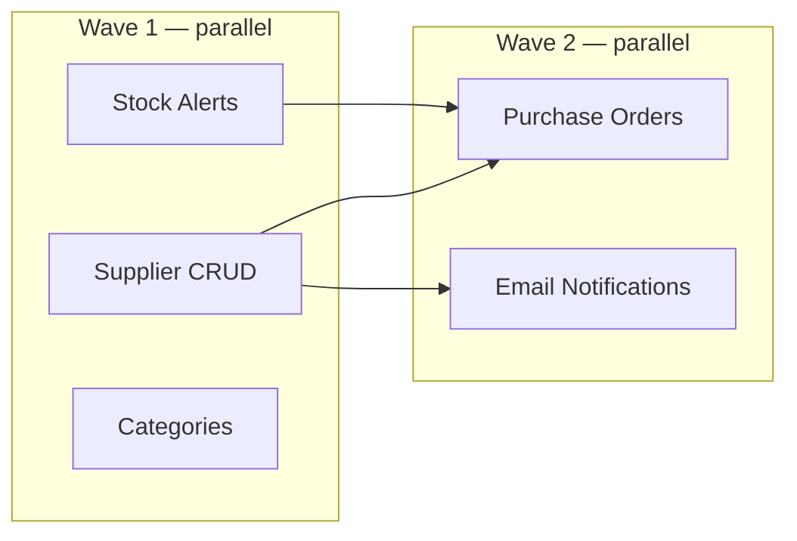

> **Recommended effort: `/effort max`** — Maximum thinking depth for critical architecture and planning decisions.


# STP: Plan

You are the CTO doing the real engineering work BEFORE any code is written. This command produces the complete technical blueprint that /stp:work-quick executes against.

No code is written during this command. Only documents and diagrams.

## Task Tracking (MANDATORY)

Create tasks for every phase so the user sees planning progress:
```
TaskCreate("Domain research")
TaskCreate("Technical research (Context7)")
TaskCreate("System architecture + diagrams")
TaskCreate("Data models + migrations")
TaskCreate("API / route design")
TaskCreate("Auth & authorization design")
TaskCreate("Error handling strategy")
TaskCreate("Cross-cutting concerns + touchpoint map")
TaskCreate("Feature breakdown + wave planning")
TaskCreate("Self-review")
TaskCreate("Critic verification")
TaskCreate("User approval")
```

Mark each `in_progress` → `completed` as you work through phases. If research reveals additional concerns, `TaskCreate` new tasks for them.

## Start the Whiteboard Server (MANDATORY — your FIRST action, before anything else)

**Architecture planning is diagram-heavy by definition.** Before any research, any sub-phase, any AskUserQuestion — **START THE WHITEBOARD SERVER RIGHT NOW.** Every user flow, data model, and API sequence you produce in this command becomes a Mermaid diagram the user should watch populate live.

Run this as the very first action of every `/stp:plan` invocation, unconditionally — no if/else, no permission prompt:

```bash
bash "${CLAUDE_PLUGIN_ROOT}/hooks/scripts/start-whiteboard.sh" "${CLAUDE_PLUGIN_ROOT}" "." &
```

Then, immediately after, print the LOUD unmissable banner by calling the shared helper via the Bash tool. This MUST be the last thing on screen before proceeding — never bury the URL mid-output:

```bash
bash "${CLAUDE_PLUGIN_ROOT}/hooks/scripts/whiteboard-banner.sh" "Architecture diagrams render live as each phase completes."
```

Do not offer an opt-out. The user chose `/stp:plan` knowing it's a heavy architecture session; the whiteboard is how they watch the architecture take shape in real time. If you find yourself about to write `AskUserQuestion(question: "Want me to open the whiteboard...")`, stop — that was the old broken pattern.

Throughout this command, write diagram data to `.stp/whiteboard-data.json` as you produce each phase. The whiteboard polls this file every 2 seconds and renders Mermaid diagrams live.

The data format:
```json
{
  "status": "Designing architecture...",
  "updated": "2026-04-02T12:00:00Z",
  "sections": [
    {
      "title": "User Flow",
      "subtitle": "How users move through the app",
      "diagrams": [
        { "label": "Primary Workflow", "code": "flowchart LR\n  A[Sign Up] --> B[Dashboard]" }
      ]
    },
    {
      "title": "Data Model",
      "diagrams": [
        { "label": "Entity Relationships", "code": "erDiagram\n  USER ||--o{ INVOICE : creates" }
      ]
    }
  ]
}
```

Update the file AFTER EACH PHASE completes — the user sees diagrams appear live as you work. Add sections incrementally, don't rewrite the whole file each time.

If the user declined the whiteboard, still include Mermaid diagrams in .stp/docs/PLAN.md (they render in GitHub/VS Code preview).

## Prerequisites

Check that .stp/docs/PRD.md exists. If it doesn't:
```
No .stp/docs/PRD.md found. Run /stp:new-project first to define what you're building.
The plan needs a PRD to design against.
```
Stop here — do not proceed without a PRD.

If .stp/docs/PRD.md exists, read it along with CLAUDE.md for context.

**Check for ui-ux-pro-max (required for UI features):**
```bash
[ -f ".claude/skills/ui-ux-pro-max/SKILL.md" ] && echo "ui-ux-pro-max: installed" || echo "ui-ux-pro-max: MISSING"
```
If MISSING and the PRD describes any UI/frontend work → install: `npm i -g uipro-cli && uipro init --ai claude`. This is a required STP companion plugin.

## Process

### Phase 0: Design System (when PRD includes ANY UI/frontend features)

If the PRD describes pages, components, layouts, dashboards, or any visual work, generate a design system BEFORE architecture planning:

1. Run ui-ux-pro-max:
```bash
python3 .claude/skills/ui-ux-pro-max/scripts/search.py "<product_type> <industry> <keywords_from_PRD>" --design-system -p "<Project Name>"
```

2. Write the design preview to `.stp/whiteboard-data.json` as a `designSystem` section (see whiteboard.md for the JSON format). If the whiteboard is running, the user sees it live.

3. Ask the user to approve the design direction before proceeding.

4. Persist the approved design system:
```bash
python3 .claude/skills/ui-ux-pro-max/scripts/search.py "<query>" --design-system --persist -p "<Project Name>"
```

This creates `design-system/MASTER.md` — the single source of truth for all UI decisions. The executor agents read this before writing any frontend code.

**If the PRD has NO UI features, skip Phase 0.**

### Phase 1: Domain Research

Research what a production version of this product actually needs. This is NOT about the tech stack (decided in /stp:new-project) — it's about the DOMAIN.

For an invoicing app, research:
- What do existing invoice tools do? (FreshBooks, Wave, Invoice Ninja)
- What are the legal requirements? (invoice numbering, tax handling, retention)
- What workflows do users expect? (create → send → track → get paid)
- What edge cases exist? (partial payments, refunds, overdue handling, recurring)

For a fitness app, research:
- What do existing apps track? (exercises, sets, reps, weight, cardio)
- What data structures do they use?
- What workflows do users expect?

Use STP's required MCP tools for research:
- **Tavily** (`tavily_search`/`tavily_research`) — search for competitor features, industry standards, user expectations, legal requirements. This is your primary domain research tool.
- **Context7** (`resolve-library-id` → `query-docs`) — query for framework-specific patterns and current API docs.
Never rely solely on training data — it may be stale. Present the research as:

```
## Domain Research

### What [product type] tools typically include
- [Feature 1 — why users expect it]
- [Feature 2 — why users expect it]

### Workflows users expect
1. [Primary workflow: e.g., Create invoice → Send → Track → Get paid]
2. [Secondary workflow]

### Edge cases we need to handle
- [Edge case 1 — what happens when...]
- [Edge case 2]

### Legal/compliance requirements (if applicable)
- [Requirement — why it matters]
```

Present the research to the user: "Here's what I found these tools typically include — I'm building all of this into the plan." Do NOT ask the user to make technical scope decisions. You are the CTO — you decide what's in and what's out.

### Phase 1b: Technical Research

Before designing the architecture, research the CURRENT state of every major technology in the stack. Your training data may be stale. This is NOT optional.

**For the framework** (Next.js, FastAPI, Rails, etc.):
- Query Context7: resolve the library ID, then query for latest patterns
- Check: any breaking changes since your training cutoff? New recommended patterns?
- Check: what's the current recommended project structure?

**For the database/ORM** (Supabase, SQLAlchemy, Prisma, etc.):
- Query Context7: latest migration patterns, connection pooling, security
- Check: Row Level Security best practices (if applicable)

**For auth** (Clerk, Auth.js, Devise, etc.):
- Query Context7: latest middleware pattern, webhook verification
- Check: any recent security advisories?

**For integrations** (Stripe, Resend, etc.):
- Query Context7: latest API version, recommended patterns
- Check: deprecated endpoints? New recommended flows?

**For testing** (Vitest, pytest, etc.):
- Query Context7: latest configuration, best practices

Record findings in .stp/docs/PLAN.md under a `## Technical Research` section:
```
## Technical Research

### Next.js (App Router)
- Current stable: [version]
- Key finding: [anything different from training data]
- Recommended pattern: [current best practice]

### Supabase
- Current stable: [version]
- Key finding: [RLS pattern, connection pooling changes, etc.]

### Stripe
- Current API version: [version]
- Key finding: [checkout flow changes, webhook patterns, etc.]
```

This research INFORMS all subsequent phases. Architecture decisions made on stale knowledge lead to rewrites.

  ┊ Researching the current state of every technology — frameworks change fast, and training data might be outdated. Better to check now than discover a deprecated pattern mid-build.

### Phase 2: System Architecture

Design the system components, how they connect, and how data flows.

**Diagrams to produce** (add to .stp/docs/PLAN.md as Mermaid blocks AND push to whiteboard):

1. **User Flow** — flowchart showing how users move through the app (signup → dashboard → primary action → outcome)
2. **System Architecture** — component diagram showing frontend, backend, database, external services and how they connect
3. **State Diagrams** — for any entity with a lifecycle (invoice: draft→sent→paid→overdue, order: placed→processing→shipped→delivered)

```
## System Architecture

### Components
[List every major component with one-line purpose]

### Data Flow
[How data moves through the system — user action → frontend → API → database → response]

### Integrations
[External services and how they connect — Stripe, email, storage, etc.]
```

For the user's understanding, explain each component in plain terms:
"The **API layer** is like a receptionist — it receives requests from the app, validates them, does the work, and sends back a response. Nothing touches the database directly."

### Phase 3: Data Models

Design every database table/model, its fields, relationships, and indexes.

**Diagram to produce:** ER diagram (Mermaid `erDiagram`) showing all entities and their relationships. Push to whiteboard.

```
## Data Models

### [Model Name] (e.g., Invoice)
| Field | Type | Purpose |
|-------|------|---------|
| id | UUID | Unique identifier |
| user_id | UUID (FK → Users) | Who owns this |
| ... | ... | ... |

Relationships:
- Invoice has many LineItems
- Invoice belongs to User
- Invoice belongs to Client

Indexes:
- user_id (all queries filter by user)
- status + created_at (dashboard sorting)
```

Explain key design decisions:
"I'm using UUIDs instead of auto-incrementing numbers for IDs. This means someone can't guess invoice URLs by incrementing numbers — if invoice #5 exists, they can't just try #6 to see someone else's invoice."

**Migration Strategy:**
For each model, also specify:
- Migration file to create (e.g., `migrations/001_create_users.sql`)
- Rollback procedure (the reverse migration)
- Seed data for development/testing

  ┊ Migrations are version-controlled database changes — instead of editing the DB directly, we write a file that says 'create this table.' Rollback undoes it. Trackable, reversible, reproducible.

### Phase 4: API/Route Design (if applicable)

Design every endpoint or route with its purpose, auth requirements, and request/response shape.

**Diagram to produce:** Sequence diagram (Mermaid `sequenceDiagram`) for each complex flow — payment processing, webhook chains, multi-step workflows. Push to whiteboard.

```
## API Design

### POST /api/invoices
Auth: Required (user must be logged in)
Purpose: Create a new invoice
Request: { client_id, line_items[], due_date, notes }
Response: { invoice }
Validation: client_id must belong to user, line_items non-empty, due_date in future

### GET /api/invoices
Auth: Required
Purpose: List user's invoices (paginated)
Query params: status, page, per_page, sort
Response: { invoices[], total, page }
```

For desktop/mobile apps without APIs, design the service layer / data access patterns instead.

### Phase 4b: Auth & Authorization Design

Design the CENTRALIZED auth model — don't leave it endpoint-by-endpoint.

```
## Auth & Authorization

### Authentication
- Provider: [Clerk / Supabase Auth / etc.]
- Protected routes: [everything except: /, /sign-in, /sign-up, /api/webhooks, /api/health]
- Session handling: [cookies / JWT / tokens — where stored, how refreshed]

### Authorization (who can do what)
- Default: users can ONLY access their own data (filter by user_id)
- Roles (if applicable): [admin, user, viewer — what each can do]
- Row-level security: [how queries are scoped to the authenticated user]

### Webhook auth
- [Each webhook endpoint: how signatures are verified]
```

  ┊ Auth is the #1 source of security vulnerabilities. Without centralized design, each endpoint invents its own auth check — some wrong, some missing. Design once, follow everywhere.

### Phase 4c: Error Handling Strategy

Design the CENTRALIZED error handling approach — not per-feature.

```
## Error Handling Strategy

### Error response format (consistent across ALL endpoints)
{ "error": "User-safe message", "code": "MACHINE_CODE", "status": 400 }

### Error propagation
- Database error → catch → log full error → return safe message
- Validation error → return field-level errors
- Auth error → 401/403 with redirect
- External service error → retry once → fallback → user message

### User-facing error messages
- NEVER show: stack traces, database names, internal paths
- ALWAYS show: what happened, what to do next, retry button if applicable

### Error tracking
- Service: [Sentry / Datadog / etc.]
- What's captured: error type, stack trace, user ID, request ID
- Alerts: on error rate spike (> X errors/minute)
```

### Phase 4d: Cross-Cutting Concerns

Identify features that touch MULTIPLE parts of the app. When a new feature is added, where does it need to appear across the ENTIRE app?

```
## Feature Touchpoint Map

For each feature, list every place in the app it should appear:

| Feature | Database | API | UI Pages | Navigation | Search | Notifications | Dashboard |
|---------|----------|-----|----------|------------|--------|--------------|-----------|
| Invoices | invoices table | /api/invoices | list, detail, create | sidebar link | searchable | on overdue | count + chart |
| Payments | payments table | /api/payments | payment page | — | — | on received | revenue chart |
| Clients | clients table | /api/clients | list, detail | sidebar link | searchable | — | top clients |
```

This map prevents the #1 solo-dev mistake: building a feature in isolation but forgetting to connect it everywhere. When "Purchase Orders" is added later, this map tells you to also update: dashboard (order count), supplier page (order history), ingredient page (link to orders), search (orders searchable), notifications (order confirmed).

**Flow domain research back to PRD:** If Phase 1 research discovered features or requirements not in .stp/docs/PRD.md, update .stp/docs/PRD.md now with the new features and acceptance criteria. The PRD must stay the source of truth for "what should exist."

### Phase 5: Feature Breakdown + Milestones

Break the PRD's features into implementation order with dependencies.

**Parallelism planning (design for maximum parallel execution):**

When creating the milestone feature list, explicitly plan which features can be built simultaneously. This is decided NOW during planning, not at build time.

**Scope prioritization — ask about borderline features:**

After listing all features, identify any that are NOT clearly essential for v1. For each borderline feature, use AskUserQuestion:

```
AskUserQuestion(
  question: "Should [feature] be part of v1?",
  options: [
    "(Recommended) Yes, build it in v1\n[Why it matters for launch — e.g., 'Users need this to complete the core workflow']",
    "Defer to v2\n[What v1 looks like without it — e.g., 'App works fine, just no export. Add it based on user feedback']",
    "Build a minimal version\n[What the simplified version looks like — e.g., 'Basic export only, no formatting options']",
    "Type something.",
    "Chat about this"
  ]
)
Why recommended: [specific reasoning for THIS feature in THIS project]
```

Examples of borderline features that should be asked about:
- Supporting tools (CLI generators, admin panels, migration scripts)
- Advanced features (export, import, analytics, reporting)
- Multi-platform support (mobile app alongside web)
- Integration features (third-party API connections, webhooks)
- Nice-to-haves (dark mode, themes, custom branding)

Essential features are NEVER asked about — auth, core CRUD, error handling, loading states. Those are always v1. Only ask about features where deferring is a REAL option that doesn't break the product.

Features the user defers go into a `## Deferred to v2` section in .stp/docs/PLAN.md and .stp/docs/PRD.md's "Out of Scope."

For each milestone, produce a **Wave Execution Plan**:

```
### Milestone 2: Core Workflow

Wave 1 (parallel — independent features):
- [ ] 4. Stock alerts        — creates: src/lib/alerts.ts, src/app/api/alerts/
- [ ] 5. Supplier CRUD        — creates: src/models/supplier.ts, src/app/suppliers/
- [ ] 6. Categories            — creates: src/models/category.ts, src/app/categories/
  (No shared files between 4, 5, 6 → safe to parallelize)

Wave 2 (after Wave 1 merges — depends on Wave 1):
- [ ] 7. Purchase orders       — depends on 4+5 (needs alerts + suppliers)
- [ ] 8. Email notifications   — depends on 5 (needs supplier emails)
  (7 and 8 share no files → parallel within Wave 2)
```

**Rules for wave assignment:**
- Compare each feature's "Create" and "Modify" file lists
- Two features sharing ANY modified file → different waves
- A feature depending on another feature's output → later wave
- Within a wave, all features are independent → parallel
- Mark the wave assignment in .stp/docs/PLAN.md — this is the execution blueprint

**Diagram to produce:** Push a dependency graph to the whiteboard showing which features can run in parallel and which must wait:



This diagram tells /stp:work-quick exactly how to execute — no analysis needed at build time, just follow the waves.

**Push the FULL build plan to the whiteboard.** After Phase 5 is complete, write a comprehensive "Build Plan" section to `.stp/whiteboard-data.json` that includes:

1. **Milestone overview** — card per milestone showing feature count, wave count, estimated complexity
2. **Wave execution diagram** — the Mermaid dependency graph per milestone (above)
3. **Feature detail cards** — each feature with: files to create/modify, test cases, dependencies, which wave it's in
4. **Timeline view** — which waves run parallel, which are sequential, the critical path

Example whiteboard data for the build plan section:
```json
{
  "title": "Build Plan",
  "subtitle": "Wave execution — what builds in parallel",
  "milestones": [
    {
      "name": "Milestone 1: Foundation",
      "goal": "Database, auth, basic CRUD",
      "features": [
        {"name": "Database setup", "done": false},
        {"name": "Auth integration", "done": false},
        {"name": "Ingredient CRUD", "done": false}
      ]
    }
  ],
  "diagrams": [
    {
      "label": "Milestone 2: Dependency Graph + Parallel Waves",
      "code": "flowchart LR\n  subgraph W1[Wave 1 — parallel]\n    F4[Stock Alerts]\n    F5[Supplier CRUD]\n  end\n  subgraph W2[Wave 2]\n    F7[Orders]\n  end\n  F4 --> F7\n  F5 --> F7"
    }
  ]
}
```

The user sees the entire build plan visualized — milestones as cards with progress tracking, waves as dependency diagrams, and they can see at a glance what will be built in parallel vs sequentially. This is presented for approval BEFORE any building starts.

**Test strategy (applies to every feature):**
- Unit tests: minimum 2 per feature (happy path + error case)
- Integration tests: 1 per cross-feature workflow (at milestone boundaries)
- E2E tests: 1 for primary user workflow (in final polish milestone)
- Target: 80%+ code coverage on critical paths (auth, payments, data mutations)

```
## Implementation Plan

Status key: [ ] pending, [x] complete, [!] blocked

### Milestone 1: Foundation
Goal: Core data models, database, and basic CRUD

Features:
- [ ] 1. Database setup + migrations
   - Create: src/db/schema.ts (or models.py, schema.rs, etc.)
   - Create: src/db/migrations/001_initial.sql
   - Tests: tests/db.test.ts — connection, schema validation
   - Dependencies: none
   
- [ ] 2. User model + auth integration
   - Create: src/models/user.ts
   - Create: src/middleware/auth.ts
   - Modify: src/app/layout.tsx (add auth provider)
   - Tests: tests/auth.test.ts — signup, login, session, protected routes
   - Dependencies: database

- [ ] 3. [Core model] CRUD
   - Create: src/models/[model].ts
   - Create: src/app/api/[model]/route.ts
   - Create: src/components/[model]-form.tsx
   - Tests: tests/[model].test.ts — create, read, update, delete, validation, auth
   - Dependencies: user model

### Milestone 2: Core Workflow
Goal: The primary user workflow works end-to-end

Features:
- [ ] 4. [Primary workflow step 1]
   - Create: [specific files]
   - Modify: [specific files]
   - Tests: [specific test file] — [specific test cases]
   - Dependencies: [which features must exist first]

- [ ] 5. [Primary workflow step 2]
   ...

### Milestone 3: Polish + Production
Goal: Error handling, loading states, empty states, edge cases

Features:
- [ ] 8. Error handling across all operations
   - Create: src/app/error.tsx (or equivalent)
   - Modify: [every API route / server action for try/catch]
- [ ] 9. Loading states for all async operations
   - Create: src/app/loading.tsx + per-route loading files
- [ ] 10. Empty states for all lists/views
    - Modify: [every list component]
- [ ] 11. Edge cases from domain research
    - [Specific files per edge case]
- [ ] 12. Error tracking + monitoring setup
    - Integrate: Sentry (or equivalent) for production error tracking
    - Add: health check endpoint (GET /api/health or equivalent)
    - ┊ Error tracking tells you something broke in production BEFORE users email you. Sentry captures every error with a stack trace and notifies instantly.
- [ ] 13. E2E test suite for primary workflow
    - Create: e2e/ directory with Playwright (web), Detox (mobile), or equivalent
    - Tests: the full primary workflow end-to-end (e.g., signup → create invoice → send → payment)
    - ┊ E2E tests drive a real browser through your app like a user would. If the signup → invoice → payment chain breaks, this catches it.

### Milestone 4: Deploy Readiness (if applicable)
Goal: Ready to go live

Features:
- [ ] 14. Environment configuration
    - Verify: all env vars documented, production values set in deployment platform
    - Create: .env.example with all required vars (no real values)
- [ ] 15. Legal/compliance basics (web-facing projects)
    - Add: privacy policy page (if collecting user data)
    - Add: terms of service page (if users pay)
    - Add: cookie consent banner (if targeting EU users)
    - Check: license audit (no GPL dependencies in proprietary code)
```

Every feature specifies exact files to create/modify and exact test files to write.
This prevents drift during implementation — Opus follows the blueprint, not improvisation.

### Phase 6: Save the Plan

Write everything to `.stp/docs/PLAN.md` at the project root. This is the technical blueprint that `/stp:work-quick` executes against.

Structure:
```markdown
# [Project Name] — Technical Plan

## Domain Research
[Phase 1 output]

## System Architecture  
[Phase 2 output]

## Data Models
[Phase 3 output]

## API / Route Design
[Phase 4 output]

## Implementation Plan
[Phase 5 output — milestones + features + files + tests + dependencies]
```

Commit: `docs: add technical plan`

### Phase 7: Self-Review (Catch Your Own Mistakes)

Before any external verification, review with fresh eyes:

1. **Placeholder scan:** Any "TBD", "TODO", "[fill in]", or incomplete sections? Fix them now.
2. **Consistency check:** Do data models match the API design? Do API routes reference models that exist? Do test cases match the features they test?
3. **Dependency check:** Can features be built in the specified order? Does feature 3 depend on something not yet built? Are there circular dependencies?
4. **File check:** Does every feature specify which files to create/modify? No vague "implement the feature" — specific file paths.
5. **Test check:** Does every feature have at least one test case? No features without tests. Are there integration tests for cross-feature workflows?
6. **Scope check:** Does the plan match the PRD? Nothing missing, nothing added that wasn't discussed?

Fix issues inline. Don't re-present — just fix and move on.

### Phase 8: Plan Verification (Separate Evaluator)

> **Profile-aware spawn — MANDATORY.** Resolve the critic model from the active STP profile via `${CLAUDE_PLUGIN_ROOT}/references/model-profiles.cjs`. In `intended-profile` and `balanced-profile` this returns `sonnet`. In `budget-profile` it returns `haiku` for the first pass — if Haiku flags ≥2 critical issues, automatically re-spawn with `model=$STP_MODEL_CRITIC_ESCALATION` (= sonnet) for the full Double-Check Protocol.

```bash
STP_MODEL_CRITIC=$(node "${CLAUDE_PLUGIN_ROOT}/references/model-profiles.cjs" resolve stp-critic)
STP_MODEL_CRITIC_ESCALATION=$(node "${CLAUDE_PLUGIN_ROOT}/references/model-profiles.cjs" resolve stp-critic-escalation)
echo "critic model: $STP_MODEL_CRITIC (escalation: $STP_MODEL_CRITIC_ESCALATION)"
```

Spawn the `stp-critic` agent to verify the plan BEFORE any code is written. Finding an architecture mistake now saves 10x vs finding it after 5 features are built on top.

```
# When STP_MODEL_CRITIC == "inherit":
Agent(name="critic-plan", subagent_type="stp-critic", prompt="...")

# When STP_MODEL_CRITIC == "sonnet" / "haiku":
Agent(name="critic-plan", subagent_type="stp-critic", model="<STP_MODEL_CRITIC>", prompt="...")
```

Prompt the Critic:

```
Verify .stp/docs/PLAN.md against .stp/docs/PRD.md. You are reviewing a PLAN, not code. Check:

1. **PRD coverage** — Does every feature in .stp/docs/PRD.md have a corresponding
   milestone/feature in .stp/docs/PLAN.md? List any gaps.

2. **Data model integrity** — Are all relationships valid? Are foreign keys
   pointing to tables that exist? Are there missing indexes for common queries?

3. **API/model consistency** — Does every API endpoint reference models that
   exist in the data model section? Do request/response shapes match the models?

4. **Dependency graph** — Can features be built in the listed order? Does any
   feature depend on something scheduled later? Are there circular dependencies?

5. **Test coverage** — Does every feature have specific test cases? Are there
   integration tests for end-to-end workflows (not just unit tests)?

6. **Security review** — Are all authenticated endpoints marked as such? Is input
   validation specified for every endpoint accepting user data? Are there rate
   limits on public endpoints?

7. **Missing concerns** — Based on the project type, is anything obviously missing?
   (error handling strategy, migration plan, deployment requirements, monitoring)

Report: PASS / ISSUES FOUND with specific findings.
```

If the Critic finds issues, fix them in .stp/docs/PLAN.md and re-run verification. Iterate until PASS.

### Phase 9: User Reviews the Written Plan

After verification passes, ask the user to review:

```
╔═══════════════════════════════════════════════════════╗
║  ✓ PLAN READY (VERIFIED)                              ║
╠───────────────────────────────────────────────────────╣
║                                                       ║
║  .stp/docs/PLAN.md saved and verified by Critic       ║
║                                                       ║
║  Milestones    [N]                                    ║
║  Features      [N]                                    ║
║  Files         [N] to create                          ║
║                                                       ║
║  · Milestone 1 (Foundation): [brief]                  ║
║  · Milestone 2 (Core): [brief]                        ║
║  · Milestone 3 (Polish): [brief]                      ║
║                                                       ║
║  Verification: PASS — [any notes]                     ║
║                                                       ║
╚═══════════════════════════════════════════════════════╝

AskUserQuestion(
  question: "Architecture plan complete. Ready to start building?",
  options: [
    "(Recommended) Looks good — start building",
    "I want to change something — let me explain",
    "Show me the whiteboard diagrams first",
    "Chat about this"
  ]
)

  ► Next: /clear, then /stp:work-quick [FIRST FEATURE from Milestone 1]
          (clear frees context — the build phase reads PLAN.md fresh from disk)
```

Wait for the user to approve. If they request changes, make them, re-verify, and ask again. Do NOT proceed to building until the user has approved the verified plan.
```

## Rules

- NO CODE during /stp:plan. Only documents.
- Every feature in the plan MUST include what tests to write BEFORE implementation.
- Dependencies between features must be explicit — can't build invoices before the database exists.
- Data models must include indexes — query performance is designed, not discovered.
- The plan is a LIVING document — /stp:work-quick updates it as decisions change.
- If the user has a focus argument (e.g., "just the database schema"), only do that phase and return. Don't force the full process for partial updates.
- Teach throughout. Explain WHY the architecture is shaped this way, not just what it is.
